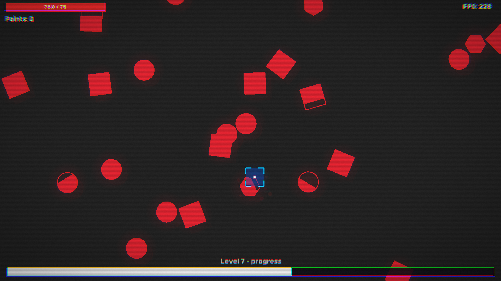
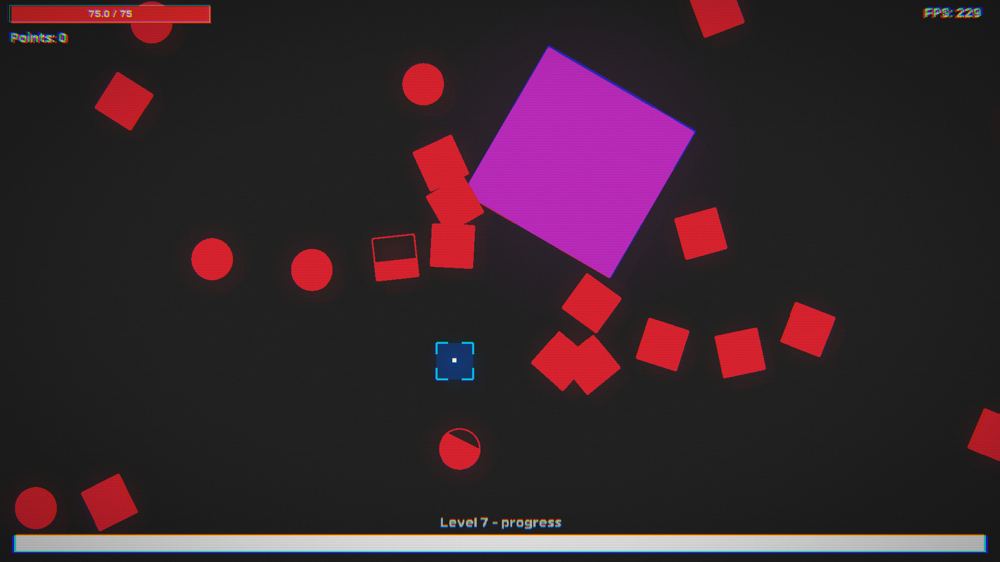

# NodeZero

A 2D arcade game built with C++17 and Raylib 5.5. Destroy nodes, collect pickups, and progress through levels.

Inspired by [Nodebuster](https://store.steampowered.com/app/268070/Nodebuster/) on Steam.


## In-Game Screenshots

<div align="center">
  
  
</div>

## Quick Start

**Prerequisites:** CMake 3.15+, Visual Studio 2022 (Windows) or GCC 8+/Clang 7+ (Linux/macOS)

```bash
# Build
cmake -B build -G "Visual Studio 17 2022"
cmake --build build --config Debug

# Run (Windows)
build\bin\Debug\NodeZero.UI.exe
# Or with forward slashes (works in Git Bash)
./build/bin/Debug/NodeZero.UI.exe

# Test (Windows)
build\bin\Debug\NodeZero.Tests.exe
# Or with forward slashes (works in Git Bash)
./build/bin/Debug/NodeZero.Tests.exe
```

**VS Code:** `Ctrl+Shift+B` to build, `F5` to debug (launch configs in `.vscode/launch.json`)

**Visual Studio:** Open folder → `Ctrl+Shift+B` → `F5`

### How to Play

**Controls:**

- **Mouse Movement** - Move your damage zone (circular area around cursor)
- **ESC** - Pause game / Access settings menu

**Game Objective:**
Survive as long as possible by destroying enemy nodes before they escape the screen. Your goal is to progress through increasingly difficult levels while managing your health and upgrading your abilities.

**Core Mechanics:**

1. **Destroy Nodes** - Hover your damage zone over enemy nodes to deal damage
2. **Collect Pickups** - Destroyed nodes drop pickups for points
3. **Complete Levels** - Destroy the required number of nodes to face the level boss and advance

**Enemy Nodes:**

- Have different shapes (Circle, Square, Hexagon) with varying HP
- Boss nodes appear at the end of each level with significantly more HP
- Enemy HP scales up with each level, increasing difficulty

**Upgrade System:**
Spend coins earned from destroyed nodes on permanent upgrades:

- **Health Upgrade (50 coins)** - Increases maximum health
- **Regeneration Upgrade (100 coins)** - Adds health regeneration over time
- **Damage Upgrade (60 coins)** - Increases damage per tick to nodes
- **Damage Zone Upgrade (75 coins)** - Expands the size of your damage zone

**Difficulty Scaling:**
As you progress through levels:

- Nodes gain more HP (scaling factor based on level)
- More nodes spawn per level
- Spawn rate increases
- Damage received increases

**Game Over:**
The game ends when your health reaches zero. Your final points are saved for future upgrade purchases.

**Save System:**
Game progress (coins, high points, upgrades, level) is automatically saved to:

- **Windows:** `%APPDATA%\NodeZero\save.dat`
- **Linux/macOS:** `~/.config/NodeZero/save.dat`

Your save data persists between sessions, allowing you to accumulate coins and upgrades over multiple playthroughs.

## Architecture

Three-layer clean architecture with strict separation:

```
NodeZero.Core/    → Pure game logic (no rendering, platform-agnostic)
NodeZero.UI/      → Raylib rendering + input handling
NodeZero.Tests/   → Google Test suite
```

Core exposes interfaces (`IGame`, `INode`) consumed by UI. Event system uses Observer pattern for decoupled communication.

## Project Structure

```
NodeZero.Core/
├── include/
│   ├── Config/GameConfig.h          # Tuning constants
│   ├── Enums/                       # NodeShape, NodeState, GameScreen, EventType
│   ├── Events/                      # Observer pattern (IEvent, IObserver, Subject)
│   ├── Services/                    # Service interfaces (Health, Upgrade, Level, etc.)
│   ├── Types/                       # Data structures (Position, SaveData, PointPickup)
│   └── IGame.h, INode.h             # Core interfaces
└── src/
    ├── Game.cpp, Node.cpp
    ├── Events/Subject.cpp           # Event system implementation
    └── Services/                    # Service implementations

NodeZero.UI/
├── include/
│   ├── Screens/                     # Screen states (Gameplay, MainMenu, Pause, etc.)
│   ├── Widgets/                     # UI components (Button, Label, Menu)
│   └── GameApp.h, Renderer.h, InputHandler.h
└── src/ + main.cpp

NodeZero.Tests/
├── EnemyTests.cpp                   # Enemy/Node behavior (16 tests)
├── ServiceTests.cpp                 # Health, Upgrade, Save services (15 tests)
├── LevelAndSpawnTests.cpp           # Level progression & spawning (14 tests)
├── PickupAndDamageTests.cpp         # Pickup collection & damage zones (16 tests)
└── GameTests.cpp                    # Game integration & stress tests (20 tests)
```

**Dependencies:** CMake auto-fetches Raylib 5.5 and Google Test 1.14.0

**Test Coverage:** 83 tests covering core game logic, services, and integration scenarios

## Development

### Rules

- **Core isolation:** Never include Raylib or rendering code in `NodeZero.Core`
- **Interface-driven:** UI depends on abstractions (`IGame`, `INode`), not implementations
- **Service-based:** Services are stateless where possible, data passed as parameters
- **Test coverage:** Add tests for new core logic and services

### Code Conventions

```cpp
// Classes & Interfaces
class GameApp { ... };
class IGame { ... };

// Members & Functions
float m_CurrentHealth;
void SpawnNode(float x, float y);

// Constants
static constexpr float NODE_SPAWN_INTERVAL = 2.0f;
```

### Configuration

Game balance tuning in [GameConfig.h](NodeZero.Core/include/Config/GameConfig.h):

```cpp
static constexpr float NODE_DEFAULT_SPEED = 75.0f;
static constexpr int POINTS_MULTIPLIER_MAX = 5;
static constexpr int HEALTH_UPGRADE_COST = 50;
static constexpr float DAMAGE_ZONE_UPGRADE_AMOUNT = 10.0f;
```

## Testing

```bash
# Run all tests (Windows)
build\bin\Debug\NodeZero.Tests.exe
# Or with forward slashes (works in Git Bash)
./build/bin/Debug/NodeZero.Tests.exe

# Filter tests
build\bin\Debug\NodeZero.Tests.exe --gtest_filter=GameTest.*

# List all tests
build\bin\Debug\NodeZero.Tests.exe --gtest_list_tests

# CTest integration
ctest --test-dir build -C Debug --output-on-failure
```

## Troubleshooting

**Build fails?**
Clear cache: `rm -rf build && cmake -B build -G "Visual Studio 17 2022"`

**Game crashes on start?**
Check assets copied: `build/bin/Debug/assets/`
Verify Raylib: `build/_deps/raylib-src/`

**Tests not found in VS?**
Rebuild: `cmake --build build --config Debug --target NodeZero.Tests`

**Want to reset game progress?**
Delete the save file:

- **Windows:** `%APPDATA%\NodeZero\save.dat`
- **Linux/macOS:** `~/.config/NodeZero/save.dat`

---

Built with [Raylib](https://www.raylib.com/)
